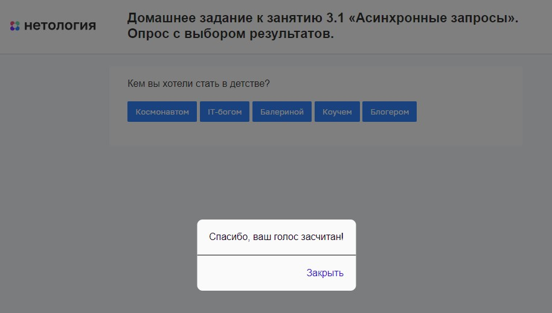

# Опрос с выбором результатов

Домашнее задание к занятию 3.1 «Асинхронные запросы» курса [«JavaScript-программирование для начинающих»](https://cat.2035.university/rall/course/18787/?project_id=48).

## **Задача**

Необходимо разработать систему опросов с выбором ответа. Данные об опросе получаются с помощью асинхронного запроса


## **Исходные данные**

1. Основная HTML-разметка
2. Базовая CSS-разметка

Стандартная структура опроса выглядит так:

```html
<div class="poll">
  <div class="poll__title" id="poll__title">
    <!--   Как вы относитесь к собакам? -->
  </div>
  <div class="poll__answers poll__answers_active" id="poll__answers">
    <!-- <button class="poll__answer">
          Хорошо
        </button>
        <button class="poll__answer">
          Отлично
        </button>
        <button class="poll__answer">
          Я люблю собак
        </button>
        <button class="poll__answer">
          Кто тут?
        </button> -->
  </div>
</div>
```

Для получения данных опроса, отправьте GET-запрос по адресу:
*https://students.netoservices.ru/nestjs-backend/poll*. В результате
вы получите JSON-данные вида:

```json
{
  "id": 1,
  "data": {
    "title": "Ваш любимый герой?",
    "answers": ["Мистер Чеснок", "Принцесса Дыня"]
  }
}
```

## **Реализация проекта**

1. Случайный опрос загружается посредством отправки GET-запроса по адресу:
   *https://students.netoservices.ru/nestjs-backend/poll*
2. Отображается вопрос и список ответов в виде кнопок
3. При нажатии на какую-либо кнопку, выводится диалоговое окно с надписью «Спасибо, ваш голос засчитан!»
4. Реализовать показ результатов голосования.


Для этого, после нажатия на ответ, отправляется POST-запрос с параметром _vote=id*опроса&answer=индекс*ответа*в*массиве_ответов_ на адрес:
*https://students.netoservices.ru/nestjs-backend/poll* с заголовком
_Content-type=application/x-www-form-urlencoded_

В ответ вы получите json-массив вида:

```json
{
  "stat": [
    {
      "answer": "Мистер Чеснок",
      "votes": 23
    },
    {
      "answer": "Принцесса Дыня",
      "votes": 56
    }
  ]
}
```

где _votes_ - количество голосов, отданных за тот или иной ответ.

Пример:

```javascript
const xhr = new XMLHttpRequest();
xhr.open('POST', 'https://students.netoservices.ru/nestjs-backend/poll');
xhr.setRequestHeader('Content-type', 'application/x-www-form-urlencoded');
xhr.send('vote=1&answer=2');
```

_индекс*ответа*в*массиве*ответов_ - число, которое соответствует индексу ответа в получаемом массиве. _id_опроса_ - свойство _id_ полученного опроса
Например, для структуры:

```json
{
  "id": 1,
  "data": {
    "title": "Ваш любимый герой?",
    "answers": ["Мистер Чеснок", "Принцесса Дыня"]
  }
}
```

Если мы хотим проголосовать за ответ «Мистер Чеснок», задается _vote=1&answer=0_,
а для ответа «Принцесса Дыня» _vote=1&answer=1_

## **Стек технологий**


## **[Демо](https://alekseeva-t-v.github.io/bhj-homeworks/async-requests/poll/task)**


