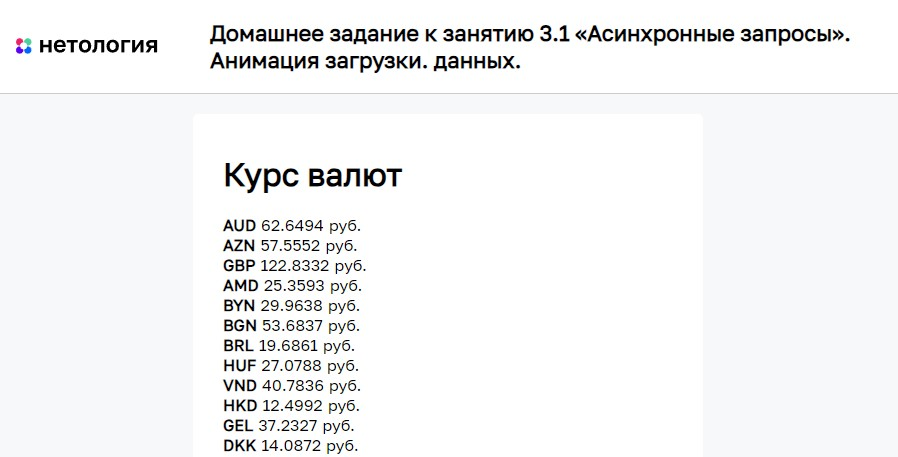

# Анимация загрузки данных

Домашнее задание к занятию 3.1 «Асинхронные запросы» курса [«JavaScript-программирование для начинающих»](https://cat.2035.university/rall/course/18787/?project_id=48).

## **Задача**

Необходимо написать загрузку курса валют. К сожалению, страница отдаёт данные довольно медленно, поэтому нужно реализовать анимацию загрузки результата.


## **Исходные данные**

1. Основная HTML-разметка
2. Базовая CSS-разметка

На странице есть изображение анимации загрузки:

```html

```

У элемента есть класс *loader_active*, при котором элемент показывается на странице
(без него элемент будет скрыт).

Все данные о курсе валют необходимо подгрузить в элемент *#items*

Стандартный HTML-шаблон для валюты:

```html
<div class="item__code">
    USD
</div>
<div class="item__value">
    32
</div>
<div class="item__currency">
    руб.
</div>
```

Для загрузки данных о курсе валют, необходимо отправить GET-запрос по адресу:
*https://students.netoservices.ru/nestjs-backend/slow-get-courses*

Данные приходят в формате JSON. Пример ответа:

```json
{
  "date": "2019-02-18 14:30:56",
  "response": {
    "Date": "2019-02-19T11:30:00+03:00",
    "PreviousDate": "2019-02-16T11:30:00+03:00",
    "PreviousURL": "//www.cbr-xml-daily.ru/archive/2019/02/16/daily_json.js",
    "Timestamp": "2019-02-18T17:00:00+03:00",
    "Valute": {
      "AUD": {
        "ID": "R01010",
        "NumCode": "036",
        "CharCode": "AUD",
        "Nominal": 1,
        "Name": "Австралийский доллар",
        "Value": 47.3467,
        "Previous": 47.2801
      },
      "AZN": {
        "ID": "R01020A",
        "NumCode": "944",
        "CharCode": "AZN",
        "Nominal": 1,
        "Name": "Азербайджанский манат",
        "Value": 39.0492,
        "Previous": 39.3188
      }
    }
  }
}
```

В данном примере в *.item__code* нужно подгрузить значение свойства *CharCode*,
в *.item__value* - *Value*

## **Реализация проекта**

1. Данные о курсе валют загружаются при отправке GET-запроса по адресу *https://students.netoservices.ru/nestjs-backend/slow-get-courses*
2. По факту загрузки анимация загрузки скрывается
3. Реализовано кэширование данных. При повторном посещении страницы выдаются данные
прошлого запроса и обновляются по получению данных со страницы.

## **Стек технологий**


## **[Демо](https://alekseeva-t-v.github.io/bhj-homeworks/async-requests/preloader/task)**

