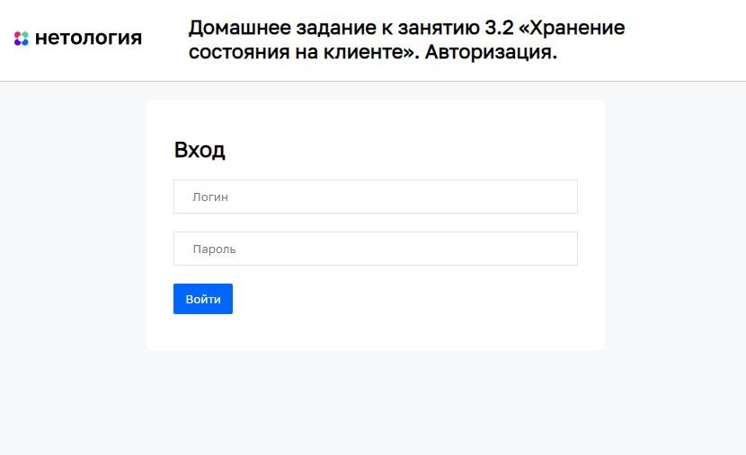

# Авторизация

Домашнее задание к занятию 3.2 «Хранение состояния на клиенте» курса [«JavaScript-программирование для начинающих»](https://cat.2035.university/rall/course/18787/?project_id=48).

## **Задача**

Необходимо разработать форму авторизации, через которую пользователь может отправлять данные
на сервер и получать ответ, а так же хранить данные о залогиневшемся пользователе.


## **Исходные данные**

1. Основная HTML-разметка
2. Базовая CSS-разметка

Форма авторизации представлена разметкой вида:

```html
<div class="signin" id="signin">
  <h2 class="title">Вход</h2>
  <form
    action="https://students.netoservices.ru/nestjs-backend/auth"
    id="signin__form"
  >
    <div class="row">
      <input type="text" name="login" class="control" placeholder="Логин" />
    </div>
    <div class="row">
      <input
        type="password"
        name="password"
        class="control"
        placeholder="Пароль"
      />
    </div>
    <div class="row">
      <button class="btn" id="signin__btn">Войти</button>
    </div>
  </form>
</div>
```

Для отображения формы необходимо задать класс _signin_active_:

```html
<div class="signin signin_active">
  <!-- ... -->
</div>
```

В момент, когда пользователь нажимает на кнопку _#signin\_\_btn_, необходимо
направить AJAX-запрос с содержимым формы по адресу
*https://students.netoservices.ru/nestjs-backend/auth*

**Важно** Если отправка формы будет реализована неверно, можно получить ошибку от сервера.

При неверных данных для входа вы получите JSON-ответ

```json
{
  "success": false
}
```

При успешной авторизации (**логин** _demo_, **пароль** _demo_)

```json
{
  "success": true,
  "user_id": 123
}
```

Блок приветствия пользователя представлен разметкой вида:

```html
<div class="welcome" id="welcome">
  Добро пожаловать, пользователь #<span id="user_id"></span>
</div>
```

Для его показа вам необходимо задать класс _welcome_active_:

```html
<div class="welcome welcome_active">
  <!-- ... -->
</div>
```

## **Реализация проекта**

1. Реализован механизм авторизации.
   Для этого данные формы с помощью POST-запроса передаются по адресу
   *https://students.netoservices.ru/nestjs-backend/auth*. После успешного входа, сохраняется полученный id-пользователя в локальное хранилище. При успешной авторизации, id пользователя задается в блок _#welcome_ и отображается. Если авторизация не удалась, выводится сообщение «Неверный логин/пароль»
2. При загрузке страницы, в случае, если в локальном хранилище имеется id пользователя, выведится блок _#welcome_ с заданным id пользователя
3. Добавлена возможность деавторизации
4. После попытки авторизации данные из полей формы очищаются

## **Стек технологий**


## **[Демо](https://alekseeva-t-v.github.io/bhj-homeworks/client-state/text-editor/task)**

