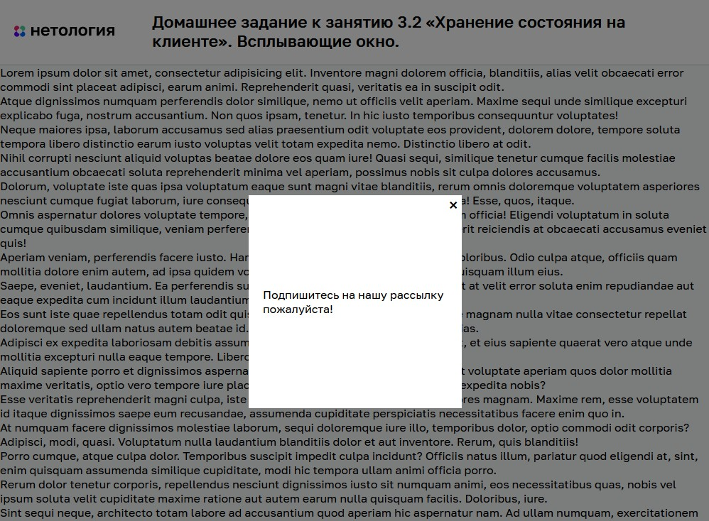

# Всплывающее окно

Домашнее задание к занятию 3.2 «Хранение состояния на клиенте» курса [«JavaScript-программирование для начинающих»](https://cat.2035.university/rall/course/18787/?project_id=48).

## **Задача**

Необходимо реализовать всплывающее окно, которое появляется только один раз. То есть, только после закрытия этого окна (а не просто обновления страницы), оно больше никогда не покажется.


## **Исходные данные**

1. Основная HTML-разметка
2. Базовая CSS-разметка

Базовая разметка окна представлена в виде:

```html
<div class="modal" id="subscribe-modal">
    <div class="modal__content">
        <div class="modal__close modal__close_times">&times;</div>
        Подпишитесь на нашу рассылку пожалуйста!
    </div>
</div>
```

При нажатии на элемент с классом *modal__close* необходимо закрыть окно.
Закрыть окно - значит удалить у него класс *modal_active*.

Открытое окно имеет следующую разметку:

```html
<div class="modal modal_active" id="subscribe-modal">
    <!-- ... -->
</div>
```

## **Реализация проекта**

1. После закрытия окна, реализована установка в cookie-файле информации о закрытии окна
2. Если после перезагрузки в cookie нет информации о закрытии, окно отображается.
3. Если страница была перезагружена с показанным окном, в cookie-файл ничего не вносится

## **Стек технологий**


## **[Демо](https://alekseeva-t-v.github.io/bhj-homeworks/client-state/popup/task)**

