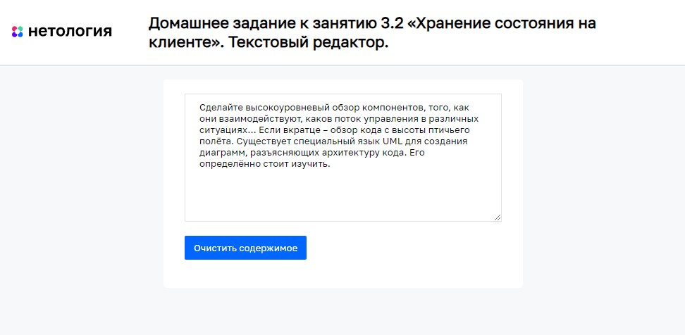

# Текстовый редактор

Домашнее задание к занятию 3.2 «Хранение состояния на клиенте» курса [«JavaScript-программирование для начинающих»](https://cat.2035.university/rall/course/18787/?project_id=48).

## **Задача**

Необходимо разработать простейший текстовый редактор, который будет сохранять своё значение даже после перезагрузки страницы.

## **Исходные данные**

1. Основная HTML-разметка

## **Реализация проекта**

1. Реализовано сохранение значений текстового редактора в локальном хранилище.
2. После перезагрузки, восстанавливается текст из локального хранилица
3. Добавлена кнопка «Очистить содержимое», при нажатии на которую текст в поле ввода очищается.

## **Стек технологий**

## **[Демо](https://alekseeva-t-v.github.io/bhj-homeworks/client-state/text-editor/task)**

