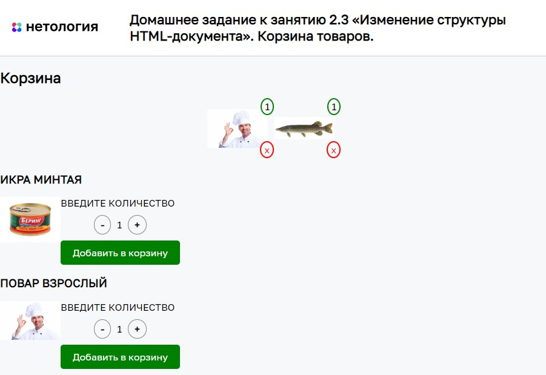

# Корзина товаров

Домашнее задание к занятию 2.3 «Изменение структуры HTML-документа» курса [«JavaScript-программирование для начинающих»](https://cat.2035.university/rall/course/18787/?project_id=48).

## **Задача**

Необходимо написать механизм добавления товаров в корзину.


## **Исходные данные**

1. Основная HTML-разметка
2. Базовая CSS-разметка

Карточка товара представляет разметку вида:

```html
<div class="product" data-id="1">
    <!-- ... -->
</div>
```

Содержимое атрибута *data-id* - уникальный идентификатор товара (артикул).

Управление количеством товара представлено следующей разметкой:

```html
<div class="product__quantity-controls">
    <div class="product__quantity-control product__quantity-control_dec">
        -
    </div>
    <div class="product__quantity-value">
        1
    </div>
    <div class="product__quantity-control product__quantity-control_inc">
        +
    </div>
</div>
```

Нажимая на элементы с классом *product__quantity-control*
необходимо уменьшить или увеличить
значение в элементе с классом *product__quantity-value*

Товар в корзине представляется следующей разметкой:

```html
<div class="cart__product" data-id="1">
    
    <div class="cart__product-count">20</div>
</div>
```

При добавлении товара в корзину:

1. Копируется его артикул и изображение
2. Количество товаров добавляется или увеличивается в соответствии с
выбранным значением (которое находится в *.product__quantity-value*)

Иными словами:

1. Элемент с классом *cart__product* имеет атрибут *data-id*. Его значение берётся из атрибута *data-id* (артикула товара) карточки товара (элемент с классом *product*)
2. В элементе с классом *cart__product-image*, атрибут *src* cодержит изображение товара (содержимое *src* элемента с классом *product__image*)

## **Реализация проекта**

1. При нажатии на кнопки увеличения/уменьшения количества товаров, число меняется. Минимальное число товаров - 1
(отрицательные значения не допускаются)
2. Реализовано добавление товара в корзину с заданным количеством.
3. Если товар уже имеется в корзине, количество увеличивается,
не добавляя в корзину новый элемент.
4. Реализовано удаление товаров из корзины
5. Корзина (и заголовок) отображаются только если в корзине есть хотя бы один товар
6. Реализован эффект перемещения товара в корзину по такому принципу:


7. Осуществляется сохранение списка добавленных в корзину товаров даже после обновления страницы.

## **Стек технологий**


## **[Демо](https://alekseeva-t-v.github.io/bhj-homeworks/document-structure/cart/task)**

