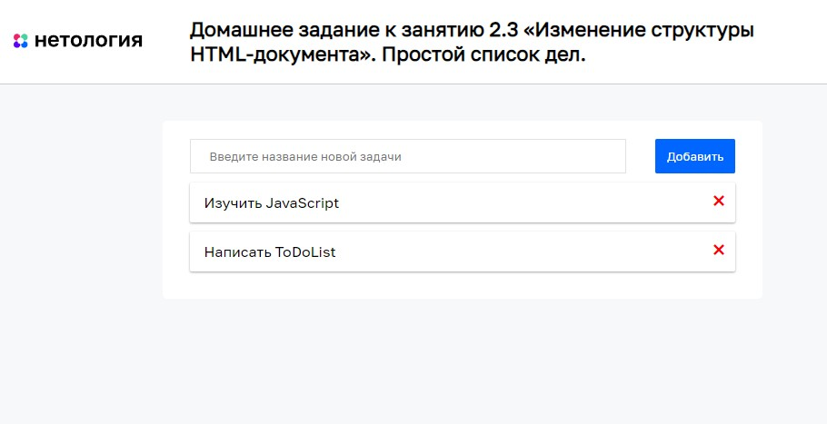

# Простой список дел

Домашнее задание к занятию 2.3 «Изменение структуры HTML-документа» курса [«JavaScript-программирование для начинающих»](https://cat.2035.university/rall/course/18787/?project_id=48).

## **Задача**

Необходимо написать простой планировщик дел.


## **Исходные данные**

1. Основная HTML-разметка
2. Базовая CSS-разметка

Шаблон новой задачи выглядит так:

```html
<div class="task">
  <div class="task__title">
    Сходить в магазин
  </div>
  <a href="#" class="task__remove">&times;</a>
</div>
```

При нажатии на элемент с классом *task__remove*, задача должна удаляться

## **Реализация проекта**

1. Реализовано добавление задач по нажатию клавиши Enter при наличии текста в поле ввода
2. Реализован механизм удаления задач
3. Для кнопок удаления задач для каждой кнопки только **один** обработчик события.
4. Реализовано сохранение задач даже после перезагрузки страницы.

## **Стек технологий**


## **[Демо](https://alekseeva-t-v.github.io/bhj-homeworks/document-structure/todo/task)**

