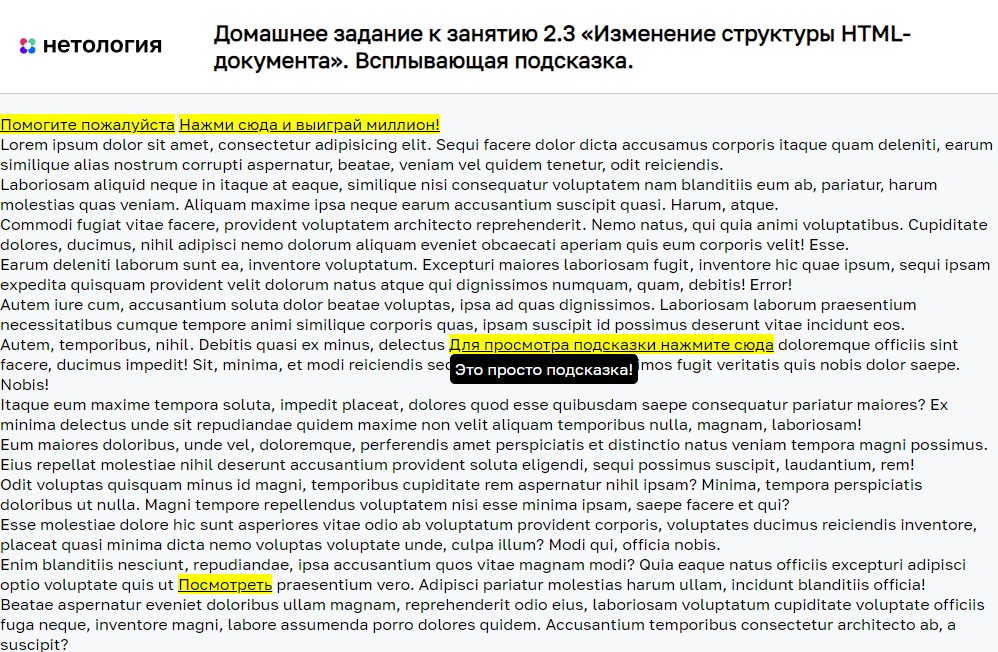

# Всплывающая подсказка

Домашнее задание к занятию 2.3 «Изменение структуры HTML-документа» курса [«JavaScript-программирование для начинающих»](https://cat.2035.university/rall/course/18787/?project_id=48).

## **Задача**

Необходимо написать всплывающую подсказку для элементов. Подсказка появляется
после клика на элементе.


## **Исходные данные**

1. Основная HTML-разметка
2. Базовая CSS-разметка

Базовая разметка элемента, который нуждается в подсказке:

```html
<a href="" class="has-tooltip" title="Что бы вы хотели?">Помогите пожалуйста</a>
```

Шаблон подсказки выглядит так:

```html
<div class="tooltip">Текст подсказки</div>
```

Данные для текста подсказки берутся из атрибута *title*

Подсказки активируются классом *tooltip_active*


## **Реализация проекта**

1. Реализовано появление подсказки на основе положения текста
2. Подсказка отображается при клике на элемент.
3. В один момент времени должна показываться только одна подсказка

## **Стек технологий**


## **[Демо](https://alekseeva-t-v.github.io/bhj-homeworks/document-structure/tooltip/task)**

