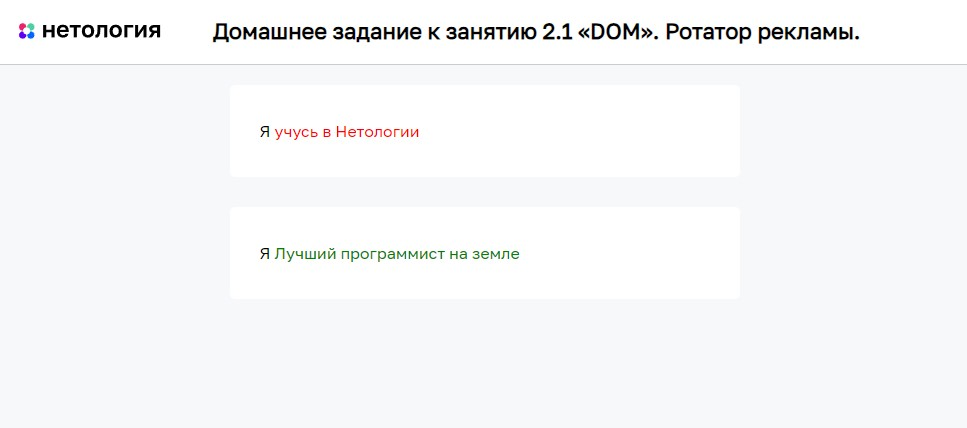

# Ротатор рекламы

Домашнее задание к занятию 2.1 «DOM» курса [«JavaScript-программирование для начинающих»](https://cat.2035.university/rall/course/18787/?project_id=48).

## **Задача**

Необходимо реализовать механизм смены текстовых объявлений. Каждое объявление меняется через 1 секунду.


## **Исходные данные**

1. Основная HTML-разметка
2. Базовая CSS-разметка

Разметка элементов выглядит следующим образом:

```html
<p>
  Я
  <span class="rotator">
    <span class="rotator__case rotator__case_active">Бог JS</span>
    <span class="rotator__case">Лучший программист на земле</span>
    <span class="rotator__case">покорю этот мир</span>
    <span class="rotator__case">учусь в Нетологии</span>
    <span class="rotator__case">счастливый как никто</span>
    <span class="rotator__case">радуюсь жизни</span>
  </span>
</p>
```

Для того, чтобы задать текстовый элемент активным, необходимо установить у него класс
*rotator__case_active*:

```html
<span class="rotator__case rotator__case_active">Бог JS</span>
```

## **Реализация проекта**

1. Каждую секунду меняется класс с одного элемента на другой
2. Сделан акцент на том, чтобы на странице можно было использовать несколько ротаторов одновременно
3. Смена текстовых блоков должна быть бесконечной.
4. Добавлены через *data-атрибуты* тегов опции:
   * Цвет текста
   * Скорость смены слайдов


Пример HTML-разметки:

```html
<p>
  Я
  <span class="rotator">
    <span class="rotator__case rotator__case_active" data-speed="1000" data-color="red">Бог JS</span>
    <span class="rotator__case" data-speed="2000" data-color="green">Лучший программист на земле</span>
    <span class="rotator__case" data-speed="1000" data-color="#000">покорю этот мир</span>
    <span class="rotator__case" data-speed="1000" data-color="red">учусь в Нетологии</span>
    <span class="rotator__case" data-speed="500" data-color="blue">счастливый как никто</span>
    <span class="rotator__case" data-speed="200" data-color="gray">радуюсь жизни</span>
  </span>
</p>
```

## **Стек технологий**


## **[Демо](https://alekseeva-t-v.github.io/bhj-homeworks/dom/ads/task)**

