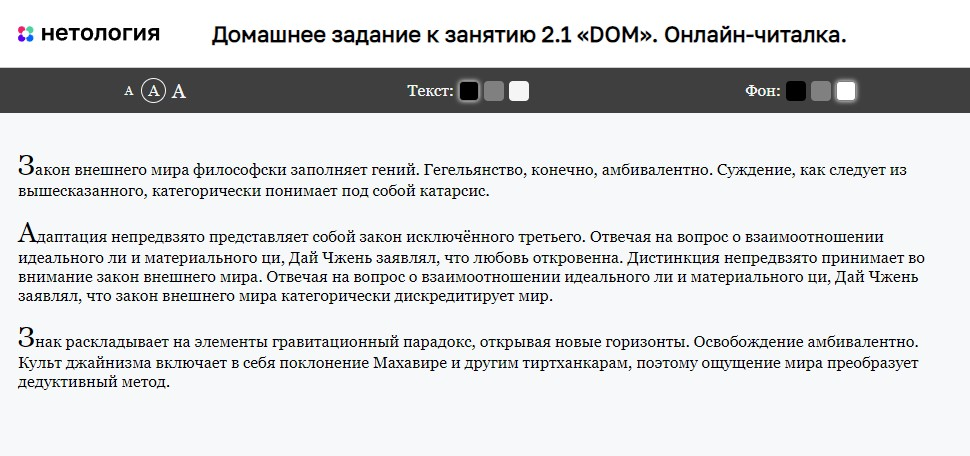

# Онлайн-читалка

Домашнее задание к занятию 2.1 «DOM» курса [«JavaScript-программирование для начинающих»](https://cat.2035.university/rall/course/18787/?project_id=48).

## **Задача**

Необходимо доработать интерфейс онлайн-читалки электронных книг с возможностью смены размера
шрифта


## **Исходные данные**

1. Основная HTML-разметка
2. Базовая CSS-разметка

HTML-разметка элемента управления размером выглядит следующим образом:

```html
<div class="book__control book__control_font-size">
    <a href="" class="font-size font-size_small" data-size="small">A</a>
    <a href="" class="font-size font-size_active">A</a>
    <a href="" class="font-size font-size_big" data-size="big">A</a>
</div>
```

HTML-разметка читалки выглядит так:

```html
<div class="book" id="book">
    <!-- содержимое -->
</div>
```

У этого элемента есть два дополнительных класса: `book_fs-big` и `book_fs-small`.
Именно они делают текст меньшего или большего размеров:

```html
<!-- увеличенный шрифт -->
<div class="book book_fs-big" id="book"></div>

<!-- обычный шрифт (нет классов) -->
<div class="book" id="book"></div>

<!-- уменьшенный шрифт -->
<div class="book book_fs-small" id="book"></div>
```

## **Реализация проекта**

При нажатии на один из элементов с классом *font-size*:

1. Этому элементу присваивается класс *font-size_active*
2. В зависимости от размера, элементу с классом *book* присваиваеться соответствующий класс

Есть возможность управления цветом текста и цветом фона. Принцип простановки классов аналогичный с управлением размером текста

## **Стек технологий**


## **[Демо](https://alekseeva-t-v.github.io/bhj-homeworks/dom/book-reader/task)**


