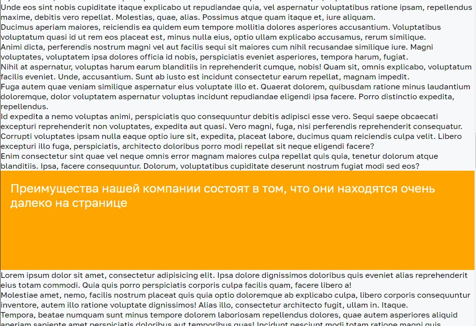

# Появление элементов при прокрутке

Домашнее задание к занятию 2.1 «DOM» курса [«JavaScript-программирование для начинающих»](https://cat.2035.university/rall/course/18787/?project_id=48).

## **Задача**

Необходимо реализовать механизм появления блоков в тот момент, когда прокрутка дойдёт до них


## **Исходные данные**

1. Основная HTML-разметка
2. Базовая CSS-разметка

Разметка элементов выглядит следующим образом:

```html
<div class="reveal">
    <!-- содержимое блока -->
</div>
```

Отображение блока осуществляется путём присовения класса *reveal_active*:

```html
<div class="reveal reveal_active">
    <!-- содержимое блока -->
</div>
```

## **Реализация проекта**

1. Установлено отслеживание изменения прокрутки окна
2. При изменении прокрутки, получаем информацию о конкретном положении элемента с классом *reveal*.
3. При нахождении элемента в поле зрения, этому элементу присваивается класс *reveal_active*

## **Стек технологий**


## **[Демо](https://alekseeva-t-v.github.io/bhj-homeworks/dom/reveal/task)**

