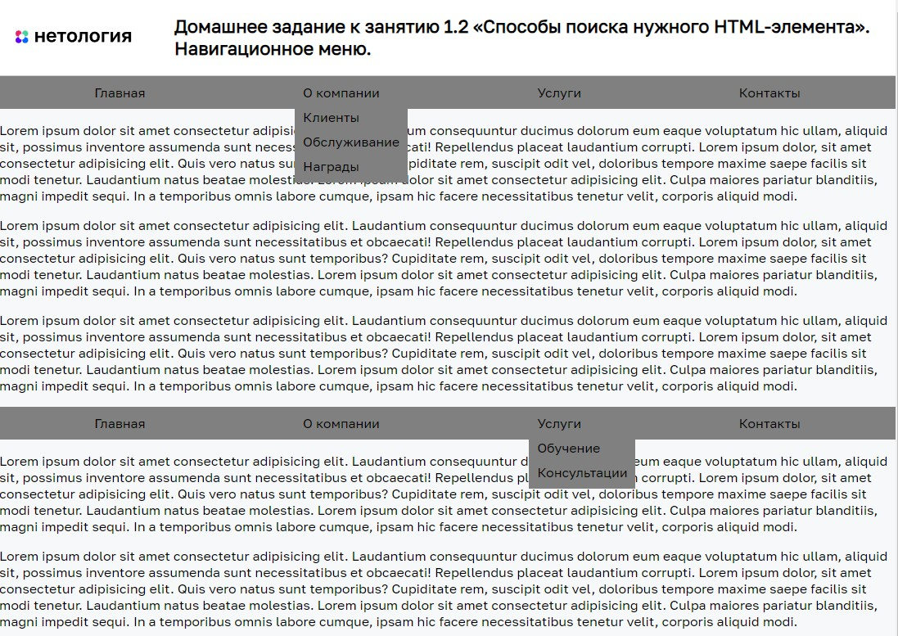

# Навигационное меню

Домашнее задание к занятию 1.2 «Способы поиска нужного HTML-элемента» курса [«JavaScript-программирование для начинающих»](https://cat.2035.university/rall/course/18787/?project_id=48).

## **Задача**

Необходимо реализовать двухуровневое навигационное меню.
При клике на пункт должны открываться подразделы


## **Исходные данные**

1. Основная HTML-разметка
2. Базовые CSS-стили

Пункты меню представлены кодом:

```html
<li class="menu__item">
    <a href="https://netology.ru/" class="menu__link">Главная</a>
</li>
```

Те, которые имеют вложенное меню:

```html
<li class="menu__item">
    <a href="" class="menu__link">О компании</a>
    <ul class="menu menu_sub">
        <li class="menu__item">
            <a href="https://netology.ru/clients" class="menu__link">Клиенты</a>
        </li>
        <li class="menu__item">
            <a href="https://netology.ru/service" class="menu__link">Обслуживание</a>
        </li>
        <li class="menu__item">
            <a href="https://netology.ru/wearecool" class="menu__link">Награды</a>
        </li>
    </ul>
</li>
```

Для показа вложенного меню, необходимо поставить класс *menu_active* вот так:

```html
<ul class="menu menu_sub menu_active">
    <!-- ... -->
</ul>

```

## **Реализация проекта**

1. Используя цикл зарегистрированы обработчики события *click* на элементах с классом *menu__link*
2. Найдено меню рядом со ссылкой. Если оно есть, у него происходит переключение класса *menu_active*
3. Запрещён переход по ссылке для тех, что имеют вложенное меню. Остальные пункты меню должны без помех переводить пользователя на соответствующие страницы.
4. Одновременно не бывает открыто более одного вложенного меню. Все остальные должны быть скрыты
1. Написан код для случая, когда на странице может быть более 1 навигационного меню.


## **Стек технологий**


## **[Демо](https://alekseeva-t-v.github.io/bhj-homeworks/element-search/menu/task)**

