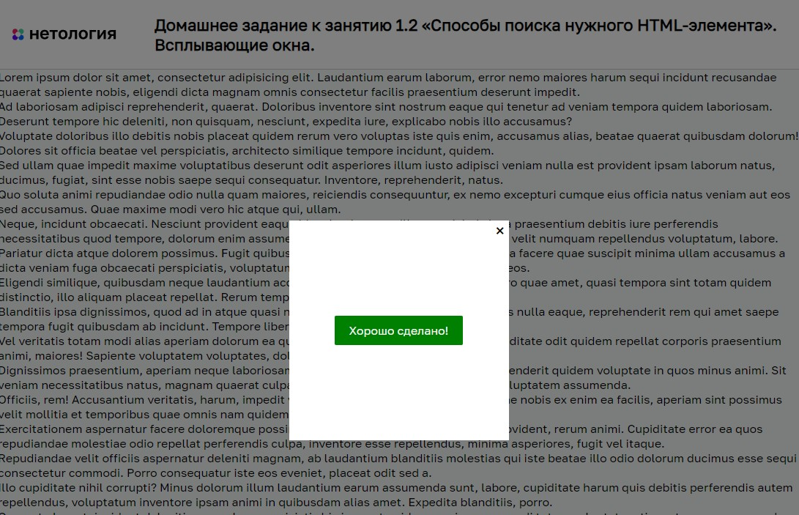

# Всплывающие окна

Домашнее задание к занятию 1.2 «Способы поиска нужного HTML-элемента» курса [«JavaScript-программирование для начинающих»](https://cat.2035.university/rall/course/18787/?project_id=48).

## **Задача**

Необходимо реализовать возможность открытия и закрытия всплывающих окон по условию.


## **Исходные данные**

1. Основная HTML-разметка
2. Базовые CSS-стили

Разметка окон представлена следующим кодом:

```html
<div class="modal" id="modal_main">
  <div class="modal__content">
    <div class="modal__close modal__close_times">&times;</div>
    <a href="#" class="btn btn_danger modal__close show-success">Сделать хорошо</a>
  </div>
</div>
```

Для того, чтобы окно было активно (показывалось на странице), ему добавляется класс
*modal_active*:

```html
<div class="modal modal_active">
    <!-- ... -->
</div>
```

Элементы с классом *modal__close* предназначены для закрытия активного окна.

## **Реализация проекта**

1. В момент запуска скрипта, отображается окно *#modal_main*
2. Реализовано закрытие активного окна по нажатию на его элемент с классом *modal__close*
3. По нажатию на элемент с классом *show-success* окно отоображается *#modal_success*

## **Стек технологий**


## **[Демо](https://alekseeva-t-v.github.io/bhj-homeworks/element-search/popups/task)**

