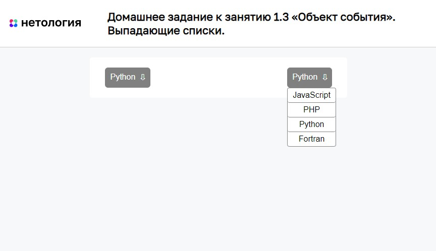

# Выпадающие списки

Домашнее задание к занятию 1.3 «Объект события» курса [«JavaScript-программирование для начинающих»](https://cat.2035.university/rall/course/18787/?project_id=48).

## **Задача**

Необходимо создать управление кнопкой с прикреплённым к ней выпадающим списком


## **Исходные данные**

1. Основная HTML-разметка
2. Базовая CSS-разметка

Базовая разметка кнопки представлена следующим кодом:

```html
<div class="dropdown">
    <div class="dropdown__value">JavaScript</div>
    <ul class="dropdown__list">
        <li class="dropdown__item">
            <a href="" class="dropdown__link">
                JavaScript
            </a>
        </li>
        <li class="dropdown__item">
            <a href="" class="dropdown__link">
                PHP
            </a>
        </li>
        <li class="dropdown__item">
            <a href="" class="dropdown__link">
                Python
            </a>
        </li>
        <li class="dropdown__item">
            <a href="" class="dropdown__link">
                Fortran
            </a>
        </li>
    </ul>
</div>
```

В элементе с классом *dropdown__value* содержится выбранное значение.

Для того, чтобы открыть меню, требуется проставить класс *dropdown__list_active*:

```html
<ul class="dropdown__list dropdown__list_active"></ul>
```

Нажатие на элемент с классом *dropdown__item* при открытом списке приводит к:
1. Закрытию списка
2. Устанавлению нового значения в элемент с классом *dropdown__value*

## **Реализация проекта**

1. Реализовано сворачивание/разворачивание списка по нажатию на кнопку
2. Производится замена значения по выбору соответствующего пункта меню
3. Предусмотрен случай, когда на странице может одновременно находиться несколько таких кнопок
4. Запрещен переход по ссылке 

## **Стек технологий**


## **[Демо](https://alekseeva-t-v.github.io/bhj-homeworks/event-object/dropdown/task)**

