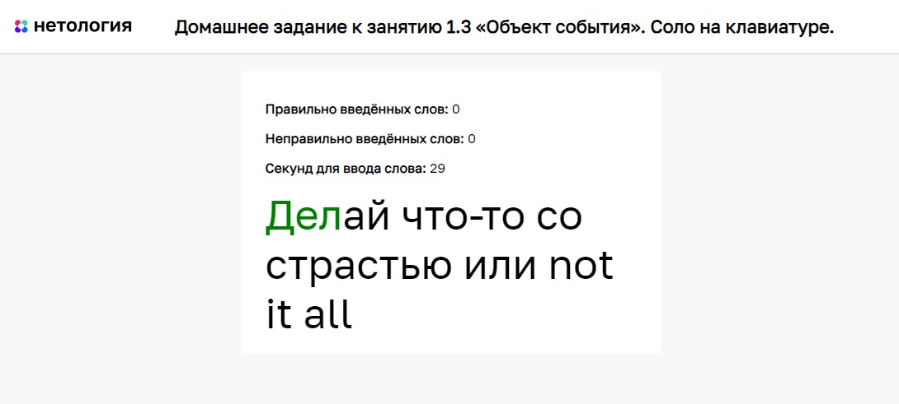

# Соло на клавиатуре

Домашнее задание к занятию 1.3 «Объект события» курса [«JavaScript-программирование для начинающих»](https://cat.2035.university/rall/course/18787/?project_id=48).

## **Задача**

Необходимо __дописать__ игру, в которой пользователь вводит слово по буквам с клавиатуры.
В случайное время появляется фраза. Если игрок вводит не так слово, ему засчитываeтся поражение. После 3 поражений игра заканчивается. Игрок побеждает после 10 побед.

## **Исходные данные**

1. Основная HTML-разметка
2. Базовая CSS-разметка
3. Базовый код игры

В настоящий момент в коде игры не хватает только обработчика ввода с клавиатуры для распознавания введённых символов и сравнении с текущим.

## **Реализация проекта**

* Дописан метод *registerEvents*, в котором задан обработчик
нажатия клавиш. Принцип работы метода:

1. Получить DOM-элемент текущего символа, который необходимо ввести (свойство *this.currentSymbol*)
2. Получить символ, который был введён с клавиатуры.
3. Если два символа одинаковые, вызывать метод *this.success*
4. Если два символа отличаются, вызвать метод *this.fail*
5. При сравнении регистр не должен быть важен (а или А)

* Добавлен таймер обратного отсчёта в код.

* Естьвозможность работать как с русскими, английскими, так и смешанными фразами
(например, «я люблю kitkat»).

## **Стек технологий**

## **[Демо](https://alekseeva-t-v.github.io/bhj-homeworks/event-object/keysolo/task)**

