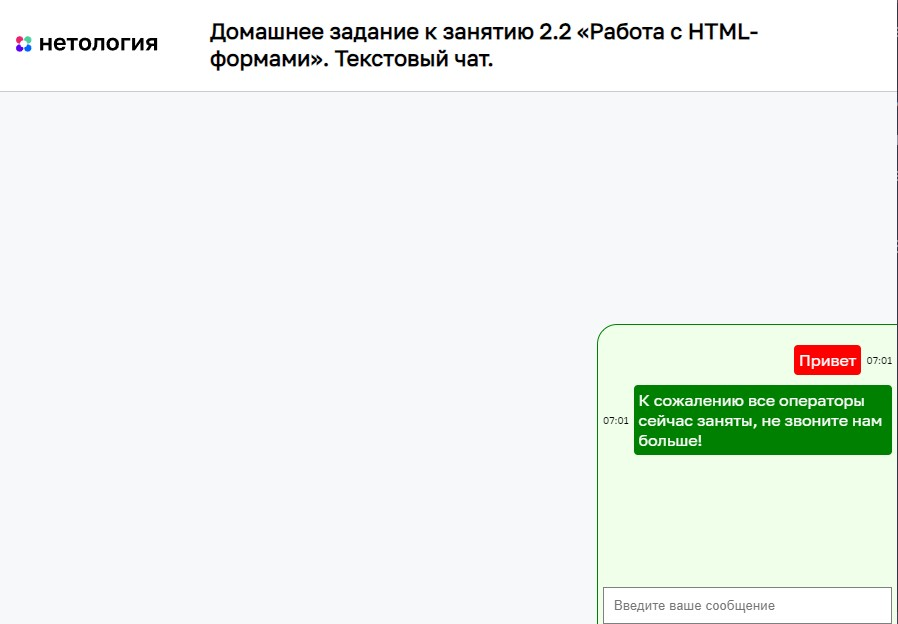

# Текстовый чат

Домашнее задание к занятию 2.2 «Работа с HTML-формами» курса [«JavaScript-программирование для начинающих»](https://cat.2035.university/rall/course/18787/?project_id=48).

## **Задача**

Необходимо написать искусственный интелект чата для компании-монополиста.
У них всё хорошо, поэтому робот на том конце постоянно грубит.


## **Исходные данные**

1. Основная HTML-разметка
2. Базовая CSS-разметка

Разметка красного бэйджа выглядит следующим образом:

```html
<div class="chat-widget">
    <!-- ... -->
</div>
```

Для того, чтобы показать окно чата, достаточно поставить этому элементу
класс *chat-widget_active*:

```html
<div class="chat-widget chat-widget_active">
    <!-- ... -->
</div>
```

HTML-структура сообщения в чате такова:

```html
<div class="message">
    <div class="message__time">22:10</div>
    <div class="message__text">Добрый день!</div>
</div>
```

Сообщение, которое отправляется пользователем, должно иметь класс *message_client*:

```html
<div class="message message_client">
    <div class="message__time">21:10</div>
    <div class="message__text">Добрый день! Хочу купить розы для любимой!</div>
</div>
```

## **Реализация проекта**

1. Реализовано открытие окна чата при нажатии на красный боковой бэйдж
2. По нажатию Enter, реализована отправка в чат __непустого__ текстового сообщения
3. Реализован ответ робота (случайное сообщение из списка)
4. Проставляется реальная дата переписки
5. Реализована автоматическая прокрутка окна чата до блока последнего комментария после каждого нового комментария.
5. При активном окне чата и простое 30 секунд, робот задает вопрос в чат

## **Стек технологий**


## **[Демо](https://alekseeva-t-v.github.io/bhj-homeworks/html-forms/chat/task)**

