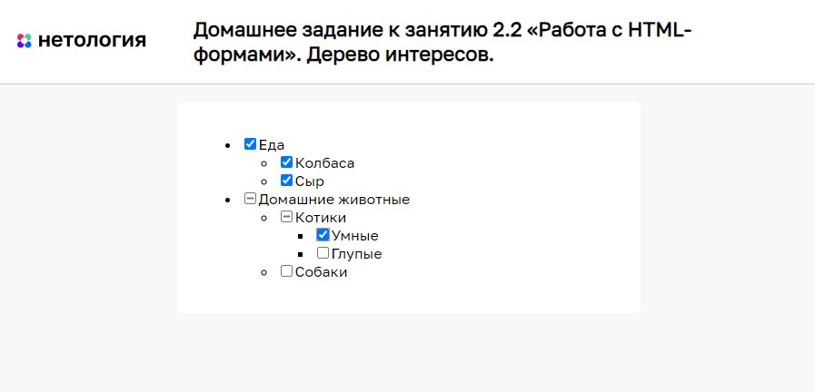

# Дерево интересов

Домашнее задание к занятию 2.2 «Работа с HTML-формами» курса [«JavaScript-программирование для начинающих»](https://cat.2035.university/rall/course/18787/?project_id=48).

## **Задача**

Необходимо написать удобное управление списком интересов для профиля пользователя.

## **Исходные данные**

1. Основная HTML-разметка
2. Базовая CSS-разметка

## **Реализация проекта**

1. Реализован функционал, когда при клике на галочку проставляются/снимаются
галочки вложенных списков
2. Простановка интересов работает на неограниченный уровень вложенности
3. Простановка галочек производится как вниз, так и вверх по дереву
(если выбраны все дочерние элементы, нужно ставить галочку; иначе снимать)
1. Для дочерних элементов, если выбраны не все галочки, у родителя устанавливается значение *indeterminate*.

## **Стек технологий**

## **[Демо](https://alekseeva-t-v.github.io/bhj-homeworks/html-forms/interests/task)**

