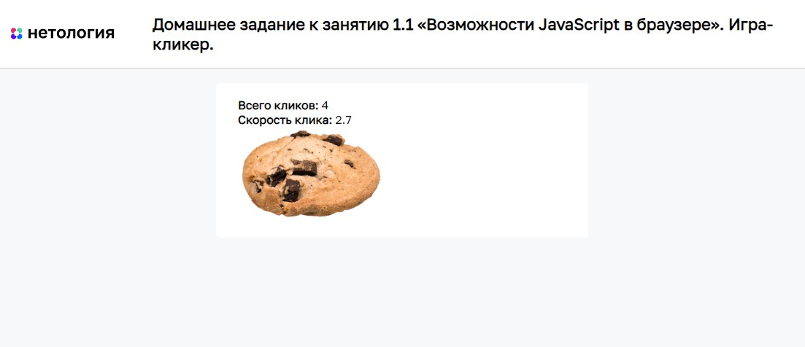

# Игра-кликер

Домашнее задание к занятию «Возможности JavaScript в браузере» курса [«JavaScript-программирование для начинающих»](https://cat.2035.university/rall/course/18787/?project_id=48).

## **Задача**

Необходимо разработать нового «убийцу времени» - кликер печенек. Всё, что делает игра -
увеличивает счётчик нажатий на печеньку.

## **Исходные данные**

Основная HTML-разметка

## **Реализация проекта**

1. Реализовано увеличение начения счётчика при каждом клике на печеньку
2. Уменьшение и увеличение печеньки при каждом клике чередуется (происходит за счет уменьшения и увеличения значения width/height)
3. Добавлен параметр «Скорость клика». Он показывает среднее количество
кликов в секунду. Значение обновляется при каждом новом клике.

Например, с момента последнего клика прошло 0.5 секунды.
Тогда скорость клика = 1/0.5 = 2 клика в секунду
## **Стек технологий**

## **[Демо](https://alekseeva-t-v.github.io/bhj-homeworks/js-features/cookie-clicker/task)**
