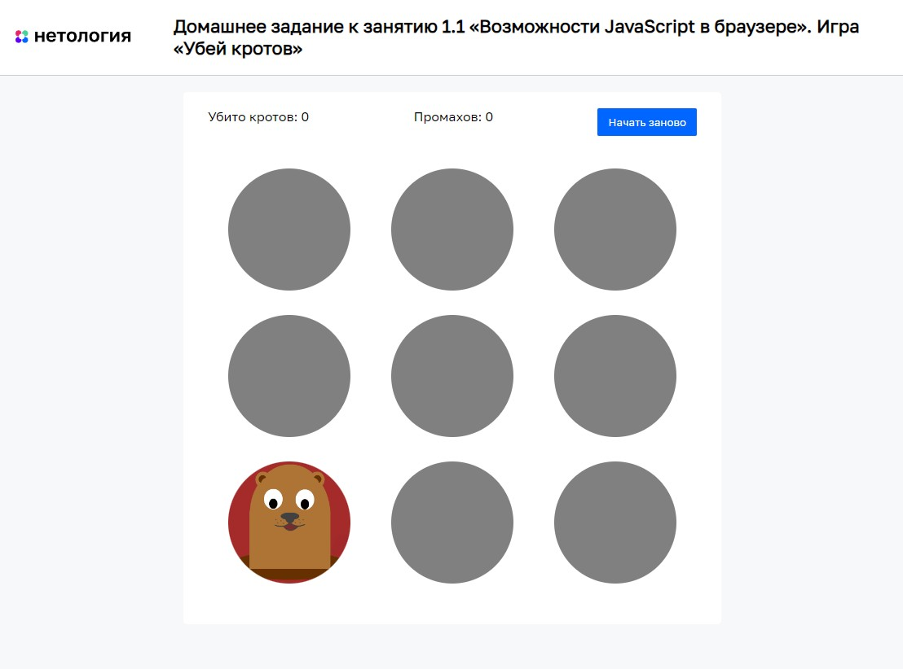

# Игра «Убей кротов»

Домашнее задание к занятию «Возможности JavaScript в браузере» курса [«JavaScript-программирование для начинающих»](https://cat.2035.university/rall/course/18787/?project_id=48).

## **Задача**

Необходимо дописать игру, убивающую кротов при клике на них.
В случайной лунке появляется крот. При нажатии на него,
игроку засчитывается +1 за нажатие.
Игрок побеждает, если своевременно убивает 10 кротов.
При 5 поражениях игра заканчивается.


## **Исходные данные**

1. Основная HTML-разметка
2. Базовые CSS-классы
3. Часть написанного кода JS

HTML-разметка представляет 9 лунок (класс _hole_), каждая со своим _id_:

```html
<div class="hole-game">
  <div class="hole hole_has-mole" id="hole1"></div>
  <div class="hole" id="hole2"></div>
  <div class="hole" id="hole3"></div>
  <div class="hole" id="hole4"></div>
  <div class="hole" id="hole5"></div>
  <div class="hole" id="hole6"></div>
  <div class="hole" id="hole7"></div>
  <div class="hole" id="hole8"></div>
  <div class="hole" id="hole9"></div>
</div>
```

## **Условия победы и поражения**

Случайным образом у одной из лунок добавляется класс `_hole_has-mole_`, что
значит, что в лунке есть крот.

Только если при клике на лунку с классом `_hole_has-mole_` засчитывается +1
к победе. В ином случае - поражение.

## **Реализация проекта**

1. Зарегистрирован обработчик событий для каждой лунки, с использованием циклов
2. Проверяется наличие нужного класса и увеличивается значение нужного счетчика
3. По выигрышу или проигрышу статистика обнуляется

## **Стек технологий**


## **[Демо](https://alekseeva-t-v.github.io/bhj-homeworks/js-features/mole-game/task)**
